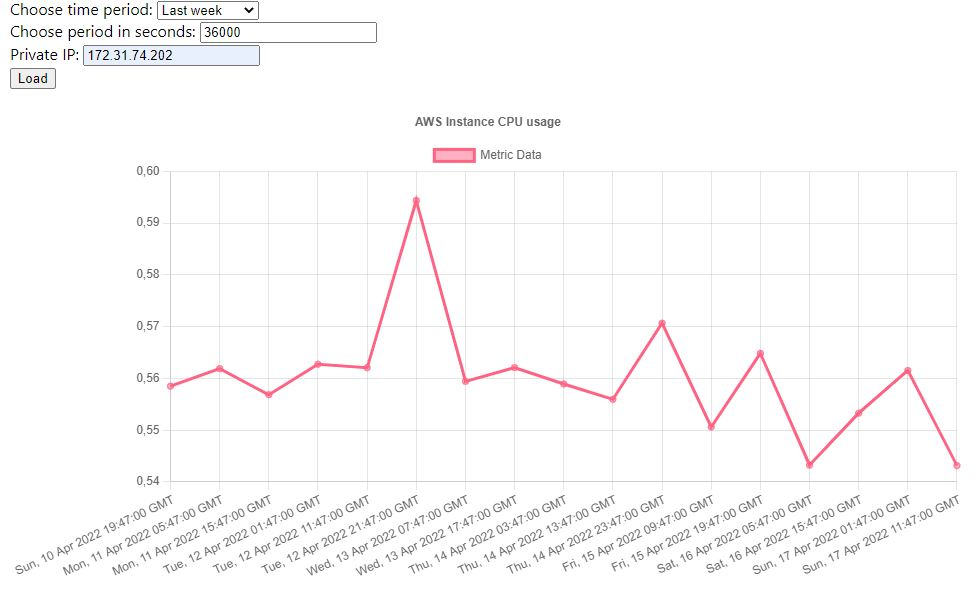

# CPUplot
## About The App
This app displays plot for average CPU usage of AWS instance. 


### Built With
* [Node.js](https://nodejs.org/)
* [React.js](https://reactjs.org/)
* [Express.js](https://expressjs.com/)
* [AWS SDK](https://aws.amazon.com/sdk-for-javascript/)
* [Charts.js React](https://www.npmjs.com/package/react-chartjs-2)

## Getting Started

1. Install server and client dependencies
```sh 
cd client
npm install
cd ../server
npm install 
```
2. Create and configure .env file in server repository
```js
ACCESSKEYID={Access Key ID}
SECRETACCESSKEY={Secret Access Key}
REGION={AWS region}
```
3. Spin up the server from server repository

``` js
npm start 
```
4. Run client side from client repository 
``` 
npm start 
```

